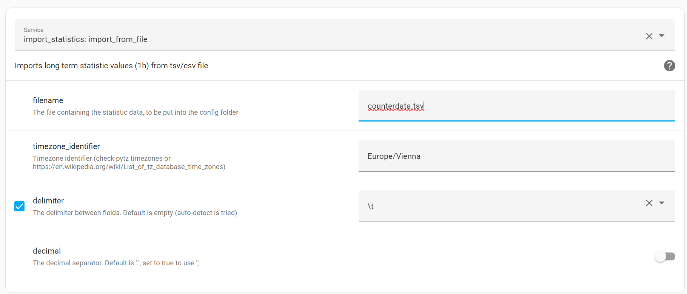

# Import statistics

This HA integration allows to import long term statistics from a file like csv or tsv.

[![GitHub Release][releases-shield]][releases]
[![GitHub Activity][commits-shield]][commits]
[![License][license-shield]](LICENSE)

<!-- ![Project Maintenance][maintenance-shield] -->

[![Community Forum][forum-shield]][forum]

**This integration just offers a service**

## Installation

### HACS

The preferred way is to use HACS:

1. Add this integration to your HA installation via HACS (it is part of HACS, so no custom repository should be needed anymore)
1. Add `import_statistics:` to your configuration .yaml (if it is possible to do this in the UI in some way without directly editing the yaml file, please let me know)
1. Restart home assistant

### Manual installation

1. Using the tool of choice open the directory (folder) for your HA configuration (where you find `configuration.yaml`).
1. If you do not have a `custom_components` directory (folder) there, you need to create it.
1. In the `custom_components` directory (folder) create a new folder called `import_statistics`.
1. Download _all_ the files from the `custom_components/import_statistics/` directory (folder) in this repository.
1. Place the files you downloaded in the new directory (folder) you created.
1. Add `import_statistics:` to your configuration .yaml (if it is possible to do this in the UI in some way without directly editing the yaml file, please let me know)
1. Restart Home Assistant

## Usage

This integration offers the service `import_from_file` to import statistics from a file.

> As this integration uses database-independent methods of the recorder to do the import, it does not depend on the used database - it should work for all databases supported by HA.

First, create your file. The structure is different for statistics with min/max/mean and counter statistics with state/sum.

Here you can find example files for both.

- [min/max/mean](./assets/min_max_mean.tsv)
- [Counters (state/sum)](./assets/state_sum.tsv)

The examples are hopefully self-explaining, just some additional information:

- You can either import min/max/mean or counters, but you cannot mix them in one file
- You can import the same or changed data as often as you like, there will not be duplicate data (as existing values will just be overwritten). So, you can use this integration to add values or to correct existing values
- You can use different settings for the delimiter (default is tab (tsv))
- For floats, the decimal separator can be '.' or ','
- You should be able to find your timezone [here](https://en.wikipedia.org/wiki/List_of_tz_database_time_zones), or check the python documentation (pytz). Keep in mind that the times are local times of the HA server.
- The timestamp (column `start`) must be of the format "%d.%m.%Y %H:%M" (e.g. "17.03.2024 02:00")
  - Always use 2 digits for all parts except the year, which needs 4 digits - just like the example above
- If you do not import values for every hour, you will get gaps in the graphs (depending on the used card and its settings)
- The minutes of the timestamp must be zero. This is due to the [long-term statistics](https://data.home-assistant.io/docs/statistics/#:~:text=Home%20Assistant%20has%20support%20for,of%20the%20short%2Dterm%20statistics.), which only store hourly values.
- If you use non-ASCII-characters (like m³) the codepage of your file must be UTF-8
- You can import:
    - Either statistics for existing sensors (internal statistics). These sensors have a '.' in its name, e.g. sensor.sun_solar_azimuth
        - If you try to import such a sensor which does not exist, you will see this sensor under developer tools / statistics, with an error. You can fix the error there, whereas fix means, remove it from database again
    - Or statistics for not existing sensors (external statistics). These sensors have a ':' in its name, e.g. sensor:not_existing_sun_solar_azimuth
- min/max/mean are pretty straight forward, whereas counters are more complex. To understand what `sum`and `state` means, you can e.g. check [this](https://developers.home-assistant.io/blog/2021/08/16/state_class_total/)
    - You can set sum to 0, if state is enough for you. Or use the same value for sum and state. Or only import sum.
    - You have to align the imported values with the first current value in your database, otherwise there will be a spike, as the difference between e.g. to energy values at 00:00 and 01:00 is the used energy for the hour starting at 00:00

Then, copy your file to your HA configuration (where you find `configuration.yaml`).

Then, go to `Developer tools / Actions` (called Services in former HA versions), and select the service `import_statistics: import_from_file`.

Fill out the settings in the UI:



or use the yaml syntax:

```yaml
service: import_statistics.import_from_file
data:
  timezone_identifier: Europe/Vienna
  delimiter: \t
  decimal: false
  filename: counterdata.tsv
```

Last, call the service. You will get feedback directly in the GUI.

> The importing is an async operation. Depending on the size of the import, it can take some time until the import is finished, even though you already get an OK as feedback in the GUI

> If importing does not work, and you do not get an error directly in the GUI, but there is an error in the home assistant logs, then this is a bug (this happens if the integration misses some checks, which lead to import errors later). Please create an issue.

## Contributions are welcome!

If you want to contribute to this please read the [Contribution guidelines](CONTRIBUTING.md)

***

[import_statistics]: https://github.com/klausj1/homeassistant-statistics
[commits-shield]: https://img.shields.io/github/commit-activity/y/klausj1/homeassistant-statistics.svg
[commits]: https://github.com/klausj1/homeassistant-statistics/commits/main
[exampleimg]: example.png
[forum-shield]: https://img.shields.io/badge/community-forum-brightgreen.svg
[forum]: https://community.home-assistant.io/t/custom-integration-to-import-long-term-statistics-from-a-file-like-csv-or-tsv
[license-shield]: https://img.shields.io/github/license/klausj1/homeassistant-statistics.svg
[releases-shield]: https://img.shields.io/github/v/release/klausj1/homeassistant-statistics?include_prereleases
[releases]: https://github.com/klausj1/homeassistant-statistics/releases

